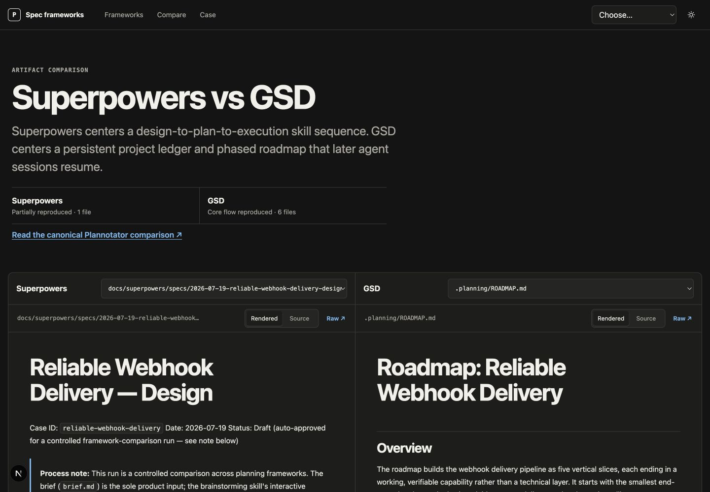

# AI coding planning frameworks: same-case examples

This repository shows what six AI coding specification and planning frameworks produce from the same realistic brief. We ran the real Superpowers, GSD, GitHub Spec Kit, Matt Pocock skills, and BMad Method workflows in isolated repositories. Kiro Specs is the clearly labeled exception: its public workflow required unavailable vendor authentication, so that example is manual and source-faithful rather than tool-generated.

“Same case” means every framework received the same product requirements for reliable webhook delivery. None received a preferred queue, database, cloud, HTTP framework, signature algorithm, retry limit, retention period, or UI.

| Framework | Tested tool | Artifact shape in this run | Result | Normal human review seam |
| --- | --- | --- | --- | --- |
| [Superpowers](examples/superpowers/raw/) | plugin `6.1.1` | dated design | Design completed; plan stalled twice | approve design before planning |
| [GSD](examples/gsd/raw/) | `@opengsd/gsd-core@1.7.0` | project, requirements, roadmap, state, phase context | Core project flow completed; phase plan stalled | project setup and phase discussion |
| [GitHub Spec Kit](examples/github-spec-kit/raw/) | source `0.13.1.dev0` at `57cc518` | constitution, spec, plan, research, model, contracts, quickstart, 69 tasks | Planning flow completed | constitution, clarification, plan, tasks |
| [Kiro Specs](examples/kiro-specs/manual/) | stable CLI `2.13.0` observed | requirements, design, tasks | Manual source-faithful example; not generated | review each linked document |
| [Matt Pocock's skills](examples/matt-pocock-skills/raw/) | plugin manifest `1.2.0` | one spec and 11 dependency-aware tickets | Spec and local-ticket flow completed | approve spec and proposed tickets |
| [BMad Method](examples/bmad-method/raw/) | `bmad-method@6.10.0` | express technical spec and memory log | Express spec flow completed | workflow validation and readiness gates |



## What to compare

- Artifact model and file tree: one long design, a three-document chain, a persistent project ledger, or a wider contract bundle.
- Workflow and task grain: large phases, independently testable stories, tracker tickets, or fine implementation steps.
- Review points: where the normal workflow expects a person to clarify, approve, or challenge an artifact.
- Tool coupling and portability: which parts remain useful as plain files and which need a plugin, issue tracker, IDE, or vendor session.
- Run friction and failure: setup, versions, interrupted stages, unavailable authentication, and choices the generator added.

The [Plannotator framework guides](https://docs.plannotator.ai/frameworks) give broader explanations. This repository stays focused on raw outputs and reproducible evidence. For the two most useful head-to-head views, see [Superpowers vs GSD](https://docs.plannotator.ai/compare/superpowers-vs-gsd) and [GitHub Spec Kit vs Kiro Specs](https://docs.plannotator.ai/compare/github-spec-kit-vs-kiro-specs).

## Browse the evidence

```text
cases/reliable-webhook-delivery/  neutral input
examples/<framework>/             raw generated or labeled manual artifacts
evidence/<framework>/             version, commit, commands, caveats, sources
data/                              structured profiles and comparisons used by the site
site/                              static-export Next.js document viewer
docs/CROSS_LINK_MANIFEST.md        contextual links for the Plannotator docs owner
STATUS.md                          dated progress, limits, and lessons
```

Generated artifacts are copied byte-for-byte from their isolated runs. The site renders Markdown for reading, but its **Source** view and **Raw** download expose the preserved file. We did not edit generated files to make one framework look better. The manual Kiro files say that they are manual at the top of every document.

## Run the local site

Node.js 22 or newer is required.

```sh
cd site
npm install
npm run dev
```

Build the static site and run all checks:

```sh
cd site
npm run lint
npm run typecheck
npm test
```

`npm run build` writes 54 pre-rendered routes plus raw files to `site/out/`. Set `NEXT_PUBLIC_SITE_ORIGIN` only when a real deployment origin exists; local builds intentionally use `http://localhost:3000` in the sitemap and do not claim a production canonical URL.

## Traceability and licenses

Every framework has a provenance record under [`evidence/`](evidence/), including the upstream repository or documentation, exact version or commit, command transcript, run date, license, editorial handling, and limitations. The shared [run environment](evidence/ENVIRONMENT.md) records the host toolchain and generated/manual rule. [`THIRD_PARTY_NOTICES.md`](THIRD_PARTY_NOTICES.md) covers included generated output. Plannotator's original site, data, brief, and commentary use the MIT license in [`LICENSE`](LICENSE).

This is an artifact comparison, not a universal ranking. One case can reveal structure and workflow, but it cannot establish that one framework wins for every team or project.
